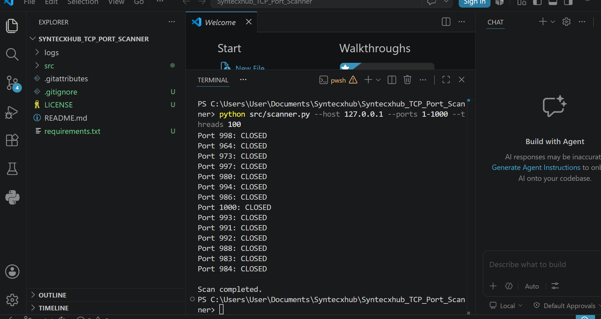
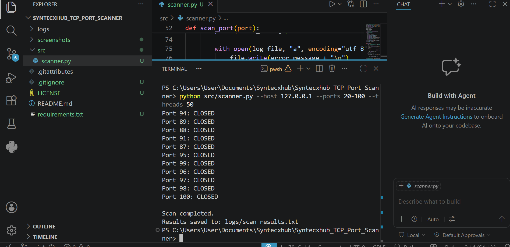
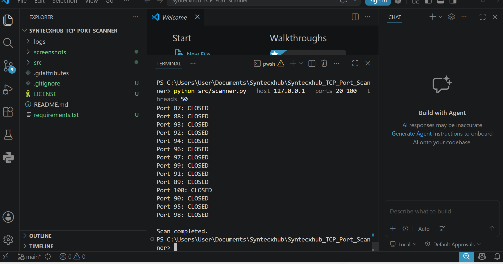

# 🌐 Syntecxhub TCP Port Scanner

## 📌 Project Overview

Syntecxhub TCP Port Scanner is a Python-based networking and cybersecurity project designed to scan target hosts for open TCP ports.

The scanner demonstrates practical skills in:
- network reconnaissance
- socket programming
- port scanning
- basic service discovery
- cybersecurity scripting

This project was created for educational and portfolio purposes to strengthen hands-on understanding of network security and vulnerability assessment fundamentals.

---

# 🚀 Features

## ✅ TCP Port Scanning
- Scans a target IP address or domain
- Detects open and closed ports
- Supports custom port ranges

## ✅ Multi-threaded Scanning
- Uses concurrent scanning to improve scanning speed
- Handles multiple ports efficiently

## ✅ Result Logging
- Saves scan results to log files
- Supports simple reporting workflows

## ✅ Error Handling
- Handles invalid hosts
- Handles connection timeouts
- Prevents scanner crashes

---

# 🛠 Technologies Used

| Technology | Purpose |
|---|---|
| Python 3 | Scanner development |
| Socket Programming | TCP connection testing |
| Concurrent Futures | Multi-threaded scanning |
| File Handling | Result logging |
| CLI Arguments | User input handling |

---

# 📂 Project Structure

```text
Syntecxhub_TCP_Port_Scanner
│
├── logs
│   └── scan_results.txt
│
├── screenshots
│   ├── scanner.png
│   ├── terminal.png
│   └── results.png
│
├── src
│   └── scanner.py
│
├── README.md
├── requirements.txt
├── LICENSE
├── .gitignore
└── .gitattributes
```

---

# ⚙️ Installation

## 1️⃣ Clone Repository

```bash
git clone https://github.com/musechuene-commits/Syntecxhub_TCP_Port_Scanner.git
```

---

## 2️⃣ Navigate Into Project

```bash
cd Syntecxhub_TCP_Port_Scanner
```

---

## 3️⃣ Install Requirements

```bash
pip install -r requirements.txt
```

---

# ▶️ Usage

Run the scanner:

```bash
python src/scanner.py --host 127.0.0.1 --ports 1-1000 --threads 100
```

---

# 🔍 Example Scan

```bash
python src/scanner.py --host 127.0.0.1 --ports 20-100 --threads 50
```

---

# 🔎 How The Scanner Works

## Step 1 — Target Input
The scanner accepts a target IP address or hostname.

## Step 2 — Port Range Selection
The user defines the port range to scan.

## Step 3 — TCP Connection Attempts
The scanner attempts TCP connections to each port.

## Step 4 — Port Status Detection
The application identifies:
- OPEN ports
- CLOSED ports

## Step 5 — Logging Results
Results are saved to:

```text
logs/scan_results.txt
```

---

# 📸 Screenshots

## 🔹 Scanner Execution



---

## 🔹 Terminal Output



---

## 🔹 Logged Results



---

# 🛡️ Security Concepts Demonstrated

- TCP/IP networking
- Port scanning
- Network reconnaissance
- Service discovery
- Multi-threaded scanning
- Security scripting
- Defensive security awareness

---

# ⚠️ Important Disclaimer

This project was created strictly for:
- educational purposes
- authorized testing
- cybersecurity portfolio demonstration

Do NOT scan systems or networks without explicit authorization.

Unauthorized scanning may violate laws and security policies.

---

# 🚀 Future Improvements

Planned future enhancements include:

- Service banner grabbing
- OS fingerprinting
- Exporting results to CSV/JSON
- GUI interface
- Scan profile presets
- IPv6 support
- Vulnerability mapping
- CIDR network scanning

---

# 📚 Skills Demonstrated

## Cybersecurity Skills
- Network reconnaissance
- Port scanning
- Vulnerability assessment fundamentals
- Ethical testing practices
- Security documentation

## Technical Skills
- Python programming
- Socket programming
- Multi-threading
- File handling
- Command-line scripting
- Troubleshooting

---

# 🎯 Key Learning Outcomes

This project strengthened practical understanding of:
- TCP connections
- open port identification
- network enumeration
- cybersecurity automation
- threaded scanning techniques
- secure and ethical testing practices

---

# 👨‍💻 Author

## Musa Chuene

- LinkedIn: https://linkedin.com/in/musa-chuene-57a4461a8
- GitHub: https://github.com/musechuene-commits